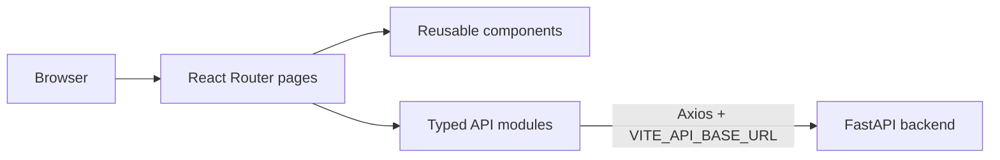

# Prashanth — Student Management Portal

Responsive React interface for managing student records through the companion FastAPI API. It is designed to be clear for nontechnical users and approachable for developers learning full-stack CRUD.

## Features

- Dashboard summary cards and a simple department bar chart
- Searchable, filterable, sortable, paginated student table
- Create, details, edit, and confirmed-delete workflows
- React Hook Form plus Zod field-level validation
- Loading, empty, API error, success notification, and 404 states
- Responsive Material UI layout with keyboard-accessible controls
- Vitest/Testing Library tests, ESLint, TypeScript, Docker, and CI

## Technology and architecture

React 19, TypeScript, Vite, React Router, Material UI, Axios, React Hook Form, Zod, Vitest, Testing Library, and ESLint.



Pages coordinate workflows; reusable components render layout/forms/states; `src/api` is the only HTTP boundary; TypeScript and Zod catch mistakes before a request reaches FastAPI.

## Folder structure

```text
src/
├── api/          # Axios client and student endpoint functions
├── components/   # layout, form, chips, loading/error states
├── pages/        # dashboard and student routes
├── schemas/      # Zod form validation
└── types/        # API and form TypeScript contracts
tests/            # behavior-focused component tests
```

## Prerequisites

- Node.js 22 or later (Node 24 LTS recommended)
- npm
- The backend running locally on port 8000

## Local setup and run

```bash
cp .env.example .env
npm ci
npm run dev
```

Open `http://localhost:5173`. Vite reloads the browser when source files change.

### Environment variable

| Variable | Purpose | Local example |
| --- | --- | --- |
| `VITE_API_BASE_URL` | Optional local FastAPI origin, without `/api/v1` | `http://localhost:8000` |

Vite embeds `VITE_*` values into the browser bundle, so never put secrets in them. Production leaves this unset and uses the Nginx `/api` reverse proxy configured through the runtime `API_UPSTREAM` value. `.env` is Git-ignored.

## Quality commands

```bash
npm run lint       # ESLint
npm run test       # Vitest once (used by CI)
npm run test:watch # Interactive local test loop
npm run build      # Type-check and produce dist/
```

Tests cover application rendering, table data, loading, empty, validation, deletion confirmation, and API failure states.

## Docker

Build and run against a backend on the Docker host:

```bash
docker build -t student-management-web .
docker run --rm -p 5173:8080 -e API_UPSTREAM=http://host.docker.internal:8000 student-management-web
```

The multi-stage image builds with Node and serves only static files from an unprivileged-port Nginx container. Nginx proxies `/api` at runtime, and its health endpoint is `/health`.

## Backend and database setup

This repository does not connect directly to PostgreSQL. Start and migrate the companion backend first:

```bash
cd ../student-management-backend
docker compose up -d db
source .venv/bin/activate
alembic upgrade head
uvicorn app.main:app --reload
```

API docs are available at `http://localhost:8000/docs`.

## CI

`.github/workflows/frontend-ci.yml` runs on pull requests and pushes to `main`. It uses Node 24 with npm caching, installs exactly `package-lock.json` using `npm ci`, then requires ESLint, Vitest, and the production build to pass. After successful `main` CI, `frontend-cd.yml` checks out both repositories, builds the unified FastAPI and React image, pushes it to Azure Container Registry, and updates the shared portal Container App using GitHub OIDC.

## Azure deployment

The companion backend repository owns `Dockerfile.unified` and `infra/main.bicep`. Azure runs the FastAPI API and compiled React portal in one Container App while Azure Database for PostgreSQL remains a separate managed database service. The Container App exposes one shareable HTTPS URL: the portal is at `/`, API routes are under `/api`, and health is available at `/health`.

Run the backend infrastructure deployment first, then configure this repository's protected `production` environment. Required secrets are `AZURE_CLIENT_ID`, `AZURE_TENANT_ID`, and `AZURE_SUBSCRIPTION_ID`; required variables are `AZURE_RESOURCE_GROUP`, `AZURE_ACR_NAME`, and `AZURE_PORTAL_APP_NAME`. The Azure federated credential must trust this repository's `production` environment.

## Troubleshooting

- **`node: command not found`:** install Node 24 LTS and open a new terminal.
- **API unreachable message:** confirm FastAPI is running and `.env` points to its exact origin.
- **Browser CORS error:** set the backend `CORS_ORIGINS=http://localhost:5173` and restart it.
- **`npm ci` reports a lock mismatch:** do not hand-edit `package-lock.json`; run `npm install` after an intentional package change and review the diff.
- **Blank route after deploying:** configure the host to rewrite unknown paths to `index.html`.
- **Port 5173 in use:** run `npm run dev -- --port 5174` and add that origin to backend CORS.

## Future improvements

Authentication, roles, courses, grades, attendance, import/export, richer charts, audit history, and provider-specific CD are intentionally deferred beyond version 1.
